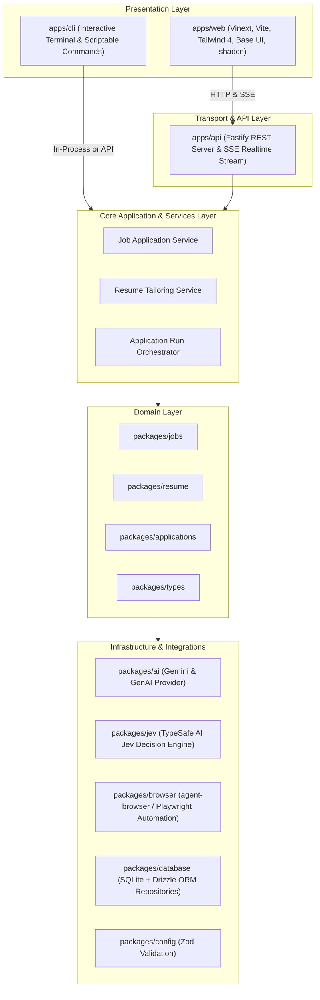
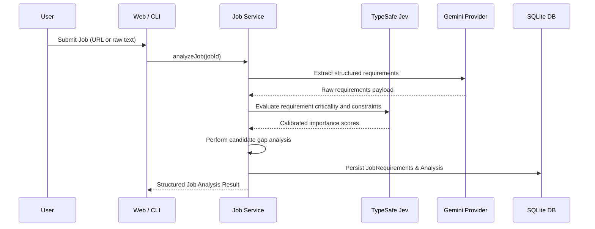
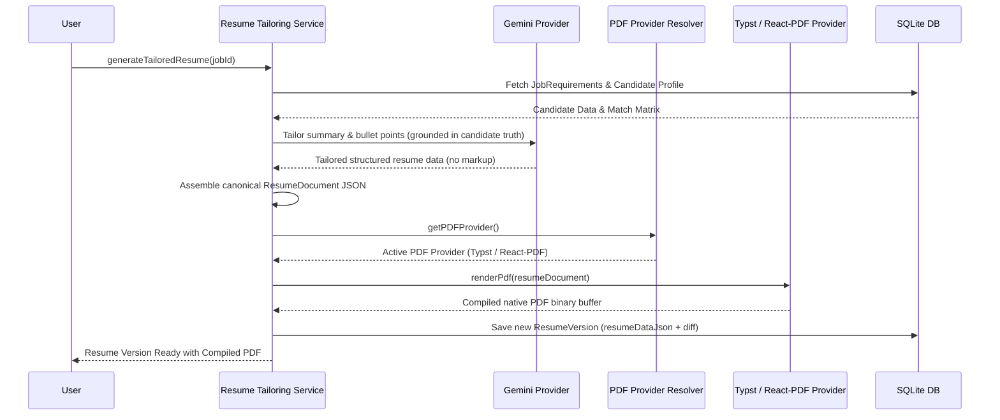
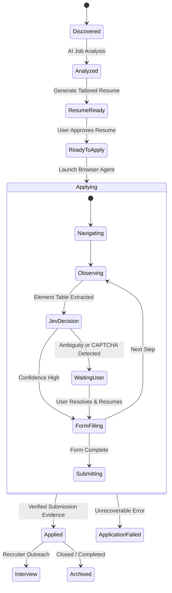

# ARCHITECTURE.md: AI Job Application Agent

This document details the high-level architecture, module boundaries, data flows, and design invariants of the **AI Job Application Agent** system.

---

## 1. System Topology

The system is organized as a Turborepo monorepo with distinct layers:

---

## 2. Monorepo Package Boundaries

| Package / App | Responsibility | Allowed Dependencies |
| :--- | :--- | :--- |
| `apps/web` | Client-side visual workspace, Kanban, Prism-inspired resume editor, execution monitor | `packages/types`, `packages/config` |
| `apps/api` | Thin HTTP routing, request validation, SSE streaming | `packages/types`, `packages/config`, `packages/jobs`, `packages/resume`, `packages/applications`, `packages/database` |
| `apps/cli` | Terminal interface with interactive wizards and direct commands | `packages/types`, `packages/config`, `packages/jobs`, `packages/resume`, `packages/applications`, `packages/database` |
| `packages/types` | Domain models, Zod schemas, state enums, DTOs | None (Zero external dependencies) |
| `packages/config` | Validated environment variables and constants | `packages/types` |
| `packages/database` | SQLite schema, migrations, Drizzle ORM repositories | `packages/types`, `packages/config` |
| `packages/ai` | LLM abstraction (`AIProvider`), Gemini adapter, structured schemas | `packages/types`, `packages/config` |
| `packages/jev` | TypeSafe AI System One decision engine, Choice/Score/Noul questions | `packages/types`, `packages/config` |
| `packages/browser` | Browser automation interface, `agent-browser` adapter, element parser | `packages/types`, `packages/config`, `packages/jev` |
| `packages/jobs` | Job ingestion, requirements extraction, gap analysis | `packages/types`, `packages/ai`, `packages/jev` |
| `packages/resume` | Resume tailoring, multi-provider PDF engine (Typst, React-PDF, deprecated LaTeX), version diffing | `packages/types`, `packages/ai` |
| `packages/applications`| Application lifecycle state machine, human-in-the-loop coordinator | `packages/types`, `packages/browser`, `packages/jev`, `packages/database` |

---

## 3. Core Domain Flows

### 3.1 Job Analysis and Requirement Extraction

### 3.2 Agnostic Resume Tailoring and Multi-Provider PDF Generation

### 3.3 Safe Browser Application with Human-in-the-Loop

---

## 4. Design Invariants and Safety Guarantees

1. **Truth Grounding**: The résumé generator strictly optimizes presentation, vocabulary alignment, and impact framing based on existing candidate experience. It never fabricates companies, degrees, or years of tenure.
2. **Deterministic Fallbacks**: Every external AI or browser provider implements a deterministic mock adapter, guaranteeing end-to-end execution during automated testing and offline development.
3. **Verified Submission**: A transition to the `Applied` status strictly requires DOM proof of submission (such as confirmation page text, confirmation number, or application receipt URL).
4. **Renderer-Agnostic AI Output**: The AI Agent strictly produces validated JSON conforming to `ResumeDocumentSchema`. It never generates LaTeX, Typst, JSX, or HTML markup. Each rendering engine possesses its own isolated template adapter.
